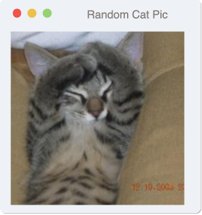
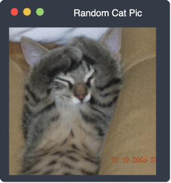

# OS-Window Vue Component


> A Vue wrapper around [os-window][os-window] which provides support for Vue events and properties.

## Getting started

Choose any of the following methods to get started. You also need to install the actual [os-window][os-window] library.

### Install via node package manager

Run the following command in your command line to add both os-window and os-window-vue to your project
```shell
# for NPM
> npm install --save os-window os-window-vue

# for YARN
> yarn add os-window os-window-vue
```

### Register the Vue component

After you obtained os-window-vue, you need to register it with Vue like this:

```javascript
import { install } from 'os-window-vue';

Vue.use(install);
```

For more information have a look at the [Installation Guide](./doc/installation.md) or the detailled [documentation](./doc/index.md).

## Examples

This example creates a non-interactive window with light macos theme
```html
<template>
  <os-window-vue
    :window-title="'Random Cat Pic'"
  >
    
  </os-window-vue>
</template>

<script>
  import OsWindowVue from 'os-window-vue';

  export default {
    components: {
      OsWindowVue,
    },
  };
</script>
```




The next example creates a fully interactive window with dark macos theme
```html
<template>
  <os-window-vue
      :hover="true"
      :interactive="true"
      :os-theme="'mac'"
      :theme="'dark'"
      :window-state="'maximized'"
      :window-title="'Random Cat Pic'"
  >
    
  </os-window-vue>
</template>

<script>
  import OsWindowVue from 'os-window-vue';

  export default {
    components: {
      OsWindowVue,
    },
  };
</script>
```
## Requirements

  - os-window: Ver. >= 0.2.0
  - Vue: Ver. >= 2.0.0
  - Browsers:
    - IE: not supported
    - Edge: Ver. >= 80
    - Firefox: Ver. >= 63
    - Chrome: Ver. >= 67
    - Safari: Ver. >= 10.1
    - Opera: Ver >= 41

## Documentation

Find more detailed information in the [documentation](./doc/index.md).

## Contributing
If you have any ideas, just [open an issue][issues] and tell me what you think.

If you find any bugs, just [open an issue][issues] and let me know. Or go right ahead and create a [pull request][pulls].

If you'd like to contribute, please fork the repository and make changes as
you'd like. Pull requests are warmly welcome.

## Licensing

This project is licensed under MIT license. You'll find a copy of the MIT license in the file [LICENSE](LICENSE).

[issues]:https://github.com/benjaminsattler/os-window-vue/issues/new
[pulls]:https://github.com/benjaminsattler/os-window-vue/pulls
[os-window]:https://github.com/benjaminsattler/os-window
